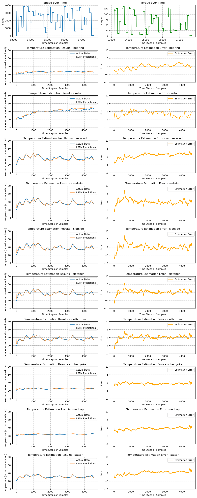
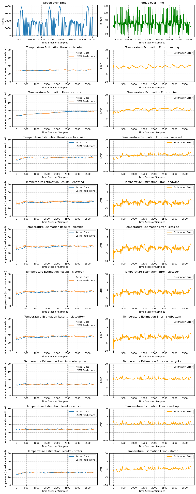

# Temperature Estimation in PMSMs using LPTN-informed LSTM neural network

This repository contains the implementation and results of a LPTN-informed LSTM for multi-node temperature estimation in PMSMs.

## Project Structure

- `\dataset`: Temperature and operation states Dataset for the tested IPMSM.
- `\matlab_PEcondition`: A simulation file using MATLAB\simulink to demonstrate the potentional limitation in third or high order LPTN global parameter identification
- `\python_LPTN_informed_LSTM`: Script for training the LSTM model.
- `lstm_training.py`: Script for training the LPTN-informed LSTM model.

## Results

The project results include temperature estimations and errors for various components of the PMSM, along with operational parameters such as speed and torque over time. The results are visualized in two separate figures, each showing 10 subplots of temperature estimation results and errors with random operation and the Federal-Test-Procedure-75_driving_cycle (the driving cycle is not put in the manuscript).

*Fig.1 Temperature Estimation results under random operation.

*Fig.2 Temperature Estimation results under Federal-Test-Procedure-75_driving cycle.

### Speed and Torque Analysis

The first row of the subplot matrix represents the speed and torque of the PMSM over time. These operational parameters are crucial as they impact the thermal behavior of the motor.

### Temperature Estimation

Subsequent rows show the actual and estimated temperatures for different components of the PMSM (bearing, rotor, active wind, etc.). The estimations are made using an LSTM network that has been trained and validated using K-fold cross-validation.

### Estimation Error

The second column of the subplot matrix highlights the estimation error, which is the difference between the actual data and LSTM predictions. This error analysis is critical for understanding the model's accuracy and identifying areas for improvement.

## Usage

To reproduce the results and visualizations, follow these steps:

1. Every code is in `lptn_informed_LSTM.ipynb` including the third-order LPTN, definition and training of LPTN-informed LSTM, hyperparameter searching.
   - Ensure you have a suitable GPU (tested with RTX2060) to run the hyperparameter searching which at the end of this nootboke, and that the estimated runtime of approximately 11.5 hours is acceptable for your setup.

## Contributing

Contributions to the project are welcome. Please ensure to follow the existing code structure and document any changes or additions clearly.

## License

[MIT License](LICENSE.md)

## Contact

For any queries or further discussion regarding the project, please open an issue in this repository or direct connect ziruiliu@hust.edu.cn.
